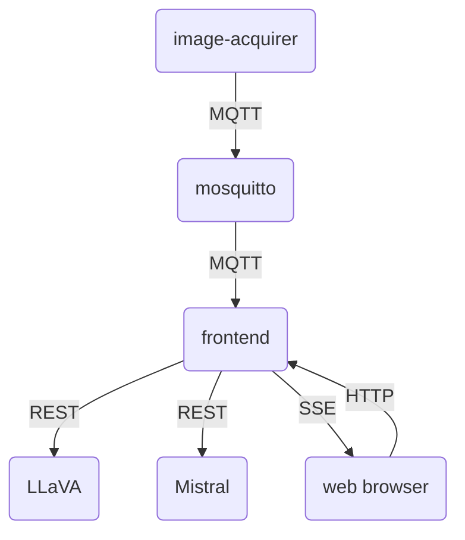
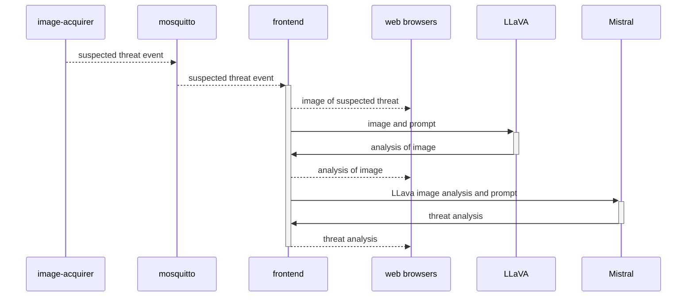

# Threat Detection Demo

## Overview

The demo consists of several components.

|Component|Description|
|---|---|
|`image-acquirer`|Grabs frame from the camera and processes it with the YOLO framework. If a suspected threat it detected, it sends an event containing the image of the suspected threat to the MQTT broker.|
|`mosquitto`|MQTT broker|
|`frontend`|Receives events from the MQTT broker and broadcasts these events to connected web browsers using Server-Sent Events (SSE). At the same time, a request is made to LLaVA to analyze the image. The analysis is then broadcasted to connected web browsers.|
|`LLaVA`|A large-language model that is capable of analyzing images.|
|`Mistral`|A model based on Mistral that has fine-tuned to recognize certain threats.|

## Deploying all components to a single OpenShift cluster

01. Provision an `AWS Blank Open Environment` in `ap-southeast-1`, create an OpenShift cluster with at least 1 `p3.8xlarge` worker node (this is needed because we are using the 34b-parameter LLaVA model)

	*   Create a new directory for the install files

			mkdir demo

			cd demo

	*   Generate `install-config.yaml`

			openshift-install create install-config

	*   Set the compute pool to 2 replicas with `p3.8xlarge` intances, and set the control plane to a single master (you will need to have `yq` installed)

			mv install-config.yaml install-config-old.yaml

			yq '.compute[0].replicas=2' < install-config-old.yaml \
			| \
			yq '.compute[0].platform = {"aws":{"zones":["ap-southeast-1a"], "type":"p3.8xlarge"}}' \
			| \
			yq '.controlPlane.replicas=1' \
			> install-config.yaml

	*   Create the cluster

			openshift-install create cluster

01. Set the `KUBECONFIG` environment variable to point to the new cluster

01. Setup the ingress with certificates from Let's Encrypt

		./scripts/setup-letsencrypt
	
	Note: After the certificates have been installed, you will need to edit `kubeconfig` and comment out `.clusters[*].cluster.certificate-authority-data`

01. Deploy all components

		make configure-infra deploy-llm deploy
	
	This does the following:

	*   Enables user workload monitoring
	*   Deploys the NFD and Nvidia GPU operators
	*   Deploys the OpenShift Serverless operator
	*   Deploys the OpenShift Service Mesh operator
	*   Deploys the OpenShift AI operator
	*   Sets up OpenShift AI
	*   Deloys Minio
	*   Uploads the mistral model to Minio
	*   Deploy KServe / vLLM with mistral
	*   Deploys the `image-acquirer`, `mosquitto`, `fontend`, `ollama` with `llava`

01. If you wish to use a different video for the `image-acquirer`,

	*   Wait for the image-acquirer to come up

			oc rollout status deploy/image-acquirer -n demo

	*   Copy the video into the pod

			SRC_VIDEO=my-video.mp4

			oc cp \
			  $SRC_VIDEO \
			  `oc get po -n demo -l app=image-acquirer -o jsonpath='{.items[0].metadata.name}'`:/videos/video.mp4 \
			  -n demo

01. When all components are up, retrieve the frontend URL and access it with a web browser

		frontend="$(oc get -n demo route/frontend -o jsonpath='{.spec.host}')"

		echo "http://$frontend"

## Running all components with `docker compose`

To run all components on your local computer with `docker compose`

	cd yaml/docker-compose

	docker compose up

## Frontend with mocks

If you wish to make changes to the static content for the frontend, you can run the frontend with a mock `image-acquirer`, mock `ollama` and a mock `openai`

	cd yaml/docker-compose

	docker compose -f frontend-with-mocks.yaml up

Any changes you make to the files in `frontend/docroot/` should be reflected immediately.
