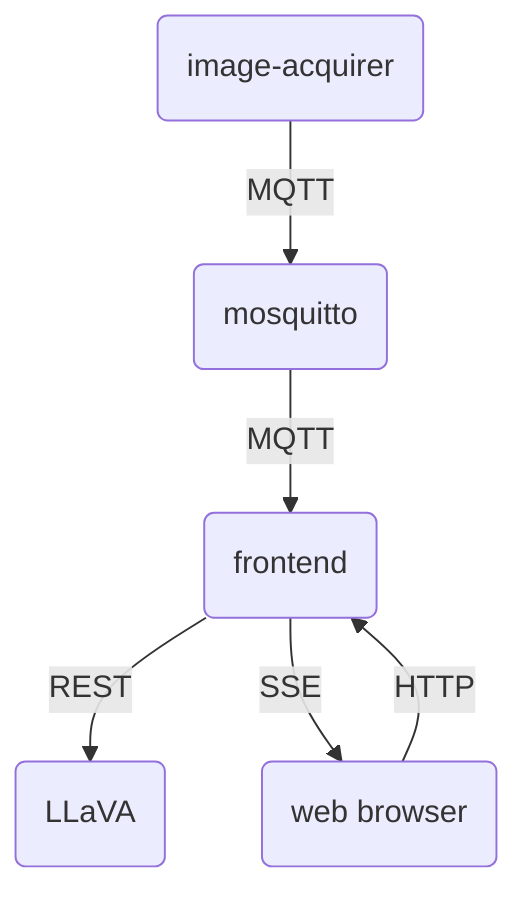
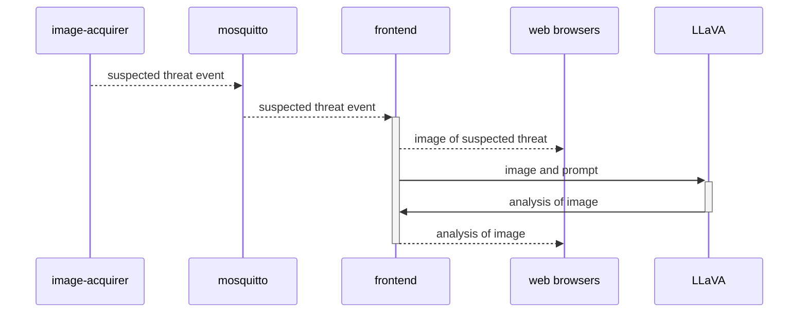

# Threat Detection Demo

## Overview

The demo consists of several components.

|Component|Description|
|---|---|
|`image-acquirer`|Grabs frame from the camera and processes it with the YOLO framework. If a suspected threat it detected, it sends an event containing the image of the suspected threat to the MQTT broker.|
|`mosquitto`|MQTT broker|
|`frontend`|Receives events from the MQTT broker and broadcasts these events to connected web browsers using Server-Sent Events (SSE). At the same time, a request is made to LLaVA to analyze the image. The analysis is then broadcasted to connected web browsers.|
|`LLaVA`|A large-language model that is capable of analyzing images.|

## Deploying all components to a single OpenShift cluster

01. Provision an `NVIDIA GPU Operator OCP4 Workshop` demo cluster

01. Login with `oc login`

01. Deploy all components

		make deploy

01. When all components are up, retrieve the frontend URL and access it with a web browser

		frontend="$(oc get -n demo route/frontend -o jsonpath='{.spec.host}')"

		echo "http://$frontend"

## Running all components with `docker compose`

To run all components on your local computer with `docker compose`

	cd yaml/docker-compose

	docker compose up

## Frontend with mocks

If you wish to make changes to the static content for the frontend, you can run the frontend with a mock `image-acquirer` and a mock `ollama`

	cd yaml/docker-compose

	docker compose -f frontend-with-mocks.yaml up

Any changes you make to the files in `frontend/docroot/` should be reflected immediately.

## Resources

*   [Paho Python Docs](https://eclipse.dev/paho/files/paho.mqtt.python/html/)
